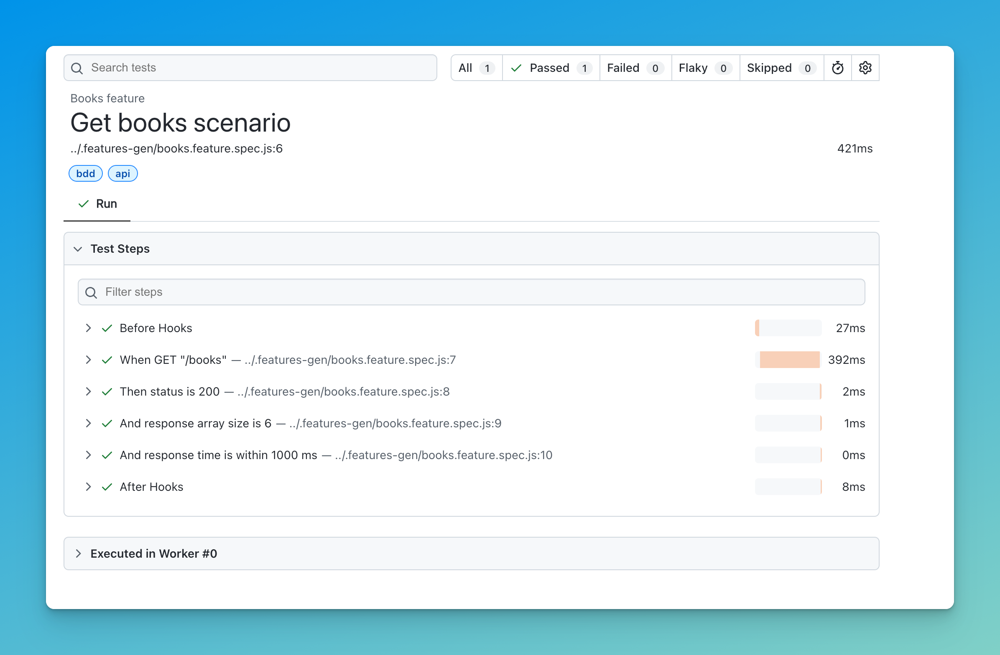
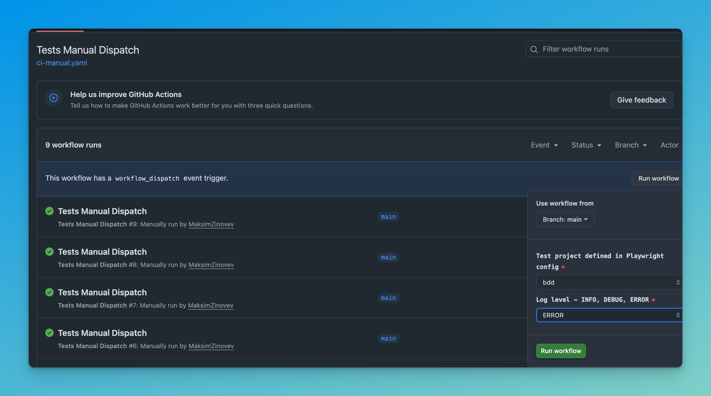

# assessment-qa-engineer-nsw-revenue

Playwright API test suite for the Simple Books API at `http://simple-books-api.glitch.me`. It covers the same endpoint two ways: plain TypeScript tests in `tests/`, and Gherkin scenarios via playwright-bdd in `features/`. Console output respects `LOG_LEVEL` (default `ERROR`).

Tools:

- Playwright/ TypeScript
- Playwright-BDD
- GitHub Actions

## Quick start

```sh
npm ci
npx playwright install-deps   # Linux only, and only if you plan browser tests
npm run api                   # or: npm run bdd
```

Both scripts list the matched tests first, then run them.

## Running locally



```sh
npm run api                   # direct API tests from tests/
npm run bdd                   # bddgen regenerates steps, then runs features/
LOG_LEVEL=INFO npm run api    # see request payloads and response stats
npx playwright show-report    # open the HTML report from the last run
```

The BDD path is two steps in one script. `npx bddgen` compiles `features/*.feature` into specs under `.features-gen/`, then Playwright runs them. Rerun the script after changing a step definition so the generated specs pick it up.

## Running in CI



`.github/workflows/ci-manual.yaml` only runs when you trigger it by hand. To do that:

1. Open the repo [MaksimZinovev/assessment-qa-engineer-nsw-revenue](https://github.com/MaksimZinovev/assessment-qa-engineer-nsw-revenue)
2. Click the Actions tab in the top bar.
3. In the left sidebar, pick "Tests Manual Dispatch".
4. On the right, click "Run workflow".
5. Leave the branch as main, choose a project (api or bdd) and a log level, then click "Run workflow".
6. The run appears at the top of the list. Click it to watch the job live.
7. When it finishes, open the run and download playwright-report from the Artifacts section at the bottom.
8. To read the report, unzip it and run `npx playwright show-report <folder>`.

The job installs dependencies, runs the script you picked with `LOG_LEVEL` set. On CI, Playwright runs with 1 worker and 2 retries. Locally there are no retries and no worker cap.

## Project structure

```text
assessment-qa-engineer-nsw-revenue/
├── features/
│   ├── books.feature          # scenario: GET /books, status, size, response time
│   └── steps/
│       ├── index.ts           # step implementations
│       └── fixtures.ts        # request context shared by all steps
├── tests/
│   └── books.spec.ts          # direct API test of GET /books
├── support/
│   └── logUtils.ts            # logger gated by LOG_LEVEL
├── data/
│   └── getBooks.json          # expected book list
├── .features-gen/             # generated from features/, gitignored, don't edit
├── .github/workflows/
│   └── ci-manual.yaml         # manual dispatch workflow
└── playwright.config.ts       # two projects: api and bdd
```

`playwright.config.ts` defines two projects. `api` points at `tests/`; `bdd` points at `.features-gen/`, which only exists after a bddgen run.
